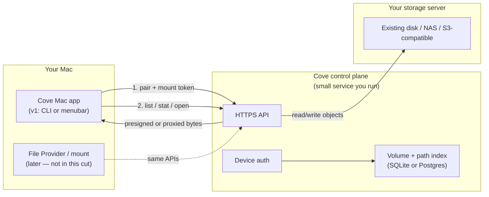
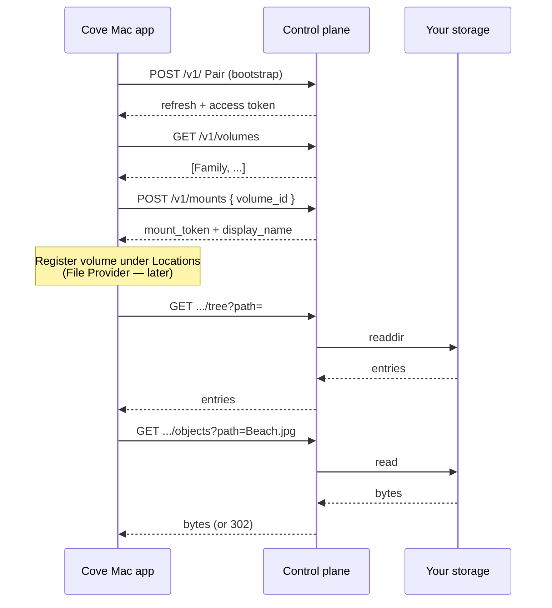

# Cove v1 — personal mount backend

Personal-use-only cut: **one operator (you), one storage server you already run, one Mac client.** No waitlist tenancy, no multi-user sharing, no org SSO. The marketing site stays separate.

Goal: Mac app proves “one click → volume under Locations → open files from your server.”

---

## Can v1 be just for me?

**Yes — and it should be.** That collapses most of the product backend:

| Skip for personal v1 | Keep |
| --- | --- |
| Multi-tenant auth / signup | Single operator + device tokens |
| Quotas, billing, invites | Hard-coded volume(s) you own |
| Family/team sharing | One private volume |
| Studio CMS / seat admin | Env + a small config file |
| Web file browser | Optional later |

Your storage server is the source of truth for blobs. Cove v1 is a **thin control plane + mount handshake** in front of it (and later a Mac File Provider that speaks this API).

---

## System diagram



**Data plane options (pick one for v1):**

1. **Proxy** — control plane streams file bytes from your server (simplest ops, more egress on the API host).
2. **Redirect / presign** — API returns a short-lived URL straight to storage (better if storage is S3-compatible or has a local HTTP file service).
3. **Direct NFS/SMB** — Mac mounts the server natively; Cove only stores “which share + creds.” Fastest personal path, weakest “Cove product” story.

Recommendation for *your* personal v1: **(1) or (2)** if you want the Cove mount story; **(3)** only as a weekend spike to feel the UX.

---

## Trust model (personal)

- One **operator** account (you), created by env bootstrap — no public signup.
- **Devices** (each Mac) pair with a one-time code or a bootstrap token from the server.
- Each device gets a long-lived **device refresh token** + short-lived **access token**.
- Mount uses a **mount grant** (volume id + scope + expiry) bound to that device.
- Revoke = delete device row; Mac loses the volume on next refresh.

No OAuth providers required for v1. Optional later: Sign in with Apple.

---

## Resources

```
Operator   you (singleton)
Device     one row per Mac
Volume     e.g. "Family" → root path on your storage server
Object     path under a volume (metadata; bytes live on storage)
MountGrant short-lived permission for a device to attach a volume
```

Example personal config (server-side, not in the marketing repo):

```toml
[[volumes]]
id = "vol_family"
name = "Family"
root = "/data/cove/family"   # or s3://bucket/family
```

---

## API sketch

Base: `https://cove.your-server.example/v1`  
Auth: `Authorization: Bearer <access_token>` unless noted.

### Auth / devices

```
POST /v1/ Pair
  Body: { "bootstrap_token": "...", "device_name": "Will’s MacBook Air" }
  → { "device_id", "refresh_token", "access_token", "access_expires_at" }

POST /v1/auth/refresh
  Body: { "refresh_token" }
  → { "access_token", "access_expires_at" }

GET  /v1/me
  → { "operator": "will", "devices": [...], "volumes": [...] }

DELETE /v1/devices/{device_id}    # revoke that Mac
```

`bootstrap_token` is a long random string in server env for personal use. Rotate by redeploying.

### Volumes

```
GET  /v1/volumes
  → { "volumes": [ { "id", "name", "root_kind": "posix"|"s3", "approx_bytes" } ] }

GET  /v1/volumes/{volume_id}
  → { "id", "name", "capabilities": ["read","write","list"] }
```

No `POST /volumes` in personal v1 — volumes are config on the server.

### Objects (metadata + bytes)

Paths are POSIX-like within the volume: `Summer holiday/Beach.jpg`.

```
GET  /v1/volumes/{volume_id}/tree?path=&depth=1
  → { "entries": [ { "name", "path", "kind": "file"|"dir", "size", "mtime", "etag" } ] }

GET  /v1/volumes/{volume_id}/stat?path=
  → { "path", "kind", "size", "mtime", "etag", "content_type" }

GET  /v1/volumes/{volume_id}/objects?path=
  → 200 file bytes
  or 302 to presigned/storage URL

PUT  /v1/volumes/{volume_id}/objects?path=
  Headers: Content-Type, If-Match (optional etag)
  Body: raw bytes
  → { "etag", "size", "mtime" }

DELETE /v1/volumes/{volume_id}/objects?path=
  → 204

POST /v1/volumes/{volume_id}/mkdir
  Body: { "path" }
  → { "path" }
```

Personal v1 can omit rename/move and versioning; add when the Mac client needs them.

### Mount handshake

This is the contract the future File Provider calls. No extension in this cut — a CLI can exercise the same flow.

```
POST /v1/mounts
  Body: { "volume_id": "vol_family", "client": { "app": "cove-mac", "build": "1" } }
  → {
      "mount_id": "mnt_...",
      "volume_id": "vol_family",
      "display_name": "Family",
      "mount_token": "<opaque JWT or random>",
      "expires_at": "...",
      "api_base": "https://cove.your-server.example/v1",
      "capabilities": ["list","read","write","hydrate"]
    }

GET  /v1/mounts/{mount_id}
  Header: Authorization: Bearer <mount_token>   # or access token
  → same payload if still valid

DELETE /v1/mounts/{mount_id}
  → 204   # unmount / revoke grant early
```

**Handshake sequence**



“One click” in product language = **valid device session + `POST /v1/mounts` + local register**. Hydration policy (“zero KB until open”) is client-side: list/stat free, `GET objects` only on open.

---

## Minimal service layout

```
cove-control/          # this would be a new repo or service — not the marketing site
  cmd/server/
  internal/
    auth/              # bootstrap + device tokens
    volumes/           # config → volume ids
    fs/                # adapter: local POSIX and/or S3
    mounts/            # mount grants
  data/
    cove.db            # SQLite is enough for personal
```

Marketing site (`cove.will.me.uk`) stays as-is. Control plane can be `drive.will.me.uk` or a LAN hostname for personal-only.

---

## Personal v1 acceptance

1. Bootstrap pair from your Mac once.  
2. `GET /volumes` shows your configured volume.  
3. `POST /mounts` returns a mount grant.  
4. CLI (or tiny menubar) lists a folder and downloads one file from your server.  
5. Revoke device → further API calls fail.  

Mac File Provider / Finder Locations = **v1.1**, same APIs.

---

## Explicit non-goals for this cut

- Public registration, waitlist integration into product auth  
- Multi-volume marketplace, sharing links, iOS  
- Editing marketing `site.ts` from this API  
- Perfect Finder parity (Tags, offline pin UI, conflict UI)
